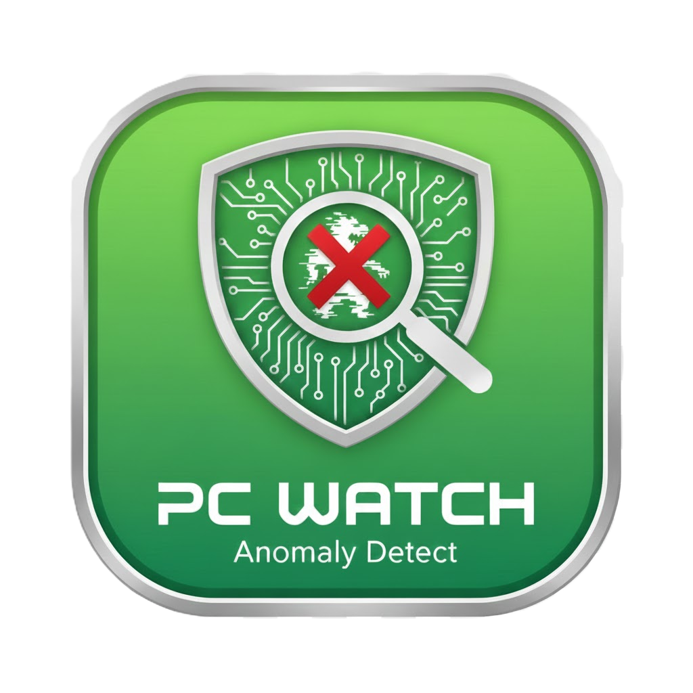
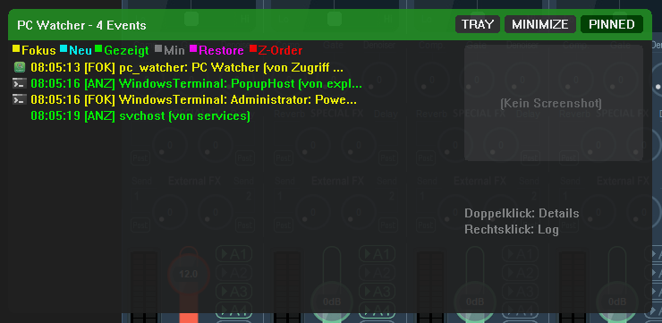

# PC Watcher

Windows tool for monitoring window focus events with GUI, tray icon, and detailed process hierarchy.



## Features

- **Real-time Monitoring**: Captures focus changes, new windows, minimization, restoration, and Z-order changes
- **Process Hierarchy**: Shows parent, grandparent, and great-grandparent processes (who started what?)
- **Icons**: Extracts and displays process icons in the log list and detail view
- **Screenshots**: Automatic screenshots on focus changes
- **Tray Icon**: Runs discreetly in the system tray
- **Detailed Logs**: Event logs with timestamp, process info, and command line

## Screenshot



## Event Types

| Event | Color | Description |
|-------|-------|-------------|
| FOCUS | Yellow | Window received focus |
| CREATED | Cyan | New window was created |
| SHOWN | Green | Window became visible |
| MINIMIZED | Gray | Window was minimized |
| RESTORED | Magenta | Window was restored |
| Z-ORDER | Red | Window was brought to foreground (Topmost) |

## Installation

### Manual
```
pc_watcher.exe
```
Starts the application with GUI and tray icon.

### Set up Autostart
```
pc_watcher.exe install
```
Creates a task in Windows Task Scheduler that automatically starts PC Watcher at logon.

### Remove Autostart
```
pc_watcher.exe uninstall
```

## Usage

### GUI Window
- **Double-click** on a log entry opens the detail view with:
  - Complete process information
  - Icons for all processes in the hierarchy
  - Paths and command lines

### Tray Icon
- **Left-click**: Show/hide window
- **Right-click**: Context menu
  - Open log file
  - Open screenshot folder
  - Exit

### Console Mode (Debugging)
```
pc_watcher.exe console
```
Starts with visible console for colored log output.

## Files

```
[Installation folder]/
├── pc_watcher.exe
└── logs/
    ├── event_YYYY-MM-DD_HH-MM-SS.log       (Event logs)
    ├── app.log.YYYY-MM-DD                  (Debug logs)
    └── YYYY-MM-DD_HH-MM-SS_ProcessName/    (Screenshot folder per alert)
        ├── screenshot_1.jpg
        ├── screenshot_2.jpg
        └── screenshot_3.jpg
```

## Building from Source

```bash
cargo build --release
```

The executable will be in `target/release/pc_watcher.exe`.

## System Requirements

- Windows 10/11
- Administrator privileges (for complete process information)

## Notes

- The tool requires administrator privileges to read process information like command lines and parent processes
- Old log files are automatically cleaned up (max 2 retained)
- Icon cache is limited to 50 entries for minimal RAM usage

## Troubleshooting

### "Access denied" for some processes
Some system processes do not allow access to their path. The process name is still captured.

## License

MIT License
